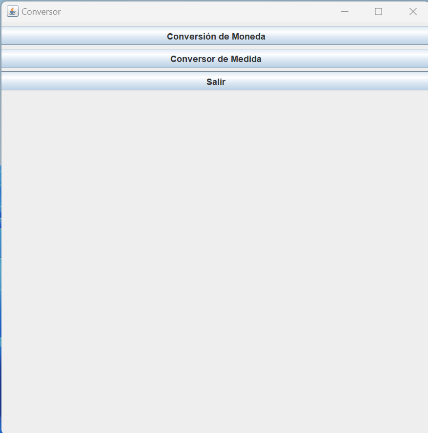

# Conversor
# Convertidor - Programa Java de Conversión de Monedas y Medidas

## Descripción

Convertidor es un programa Java diseñado para realizar conversiones de monedas y medidas. Permite al usuario ingresar un valor en una moneda o una unidad de medida y obtener su equivalente en otra moneda o unidad de medida.

## Funcionalidades

- Conversión de monedas: El programa permite al usuario ingresar un valor en una moneda (por ejemplo, dólar, euro, libra, etc.) y convertirlo a otra moneda de su elección utilizando tasas de cambio actualizadas.

- Conversión de medidas: El programa también admite conversiones entre diferentes unidades de medida, como longitud, peso, temperatura, etc. Los usuarios pueden ingresar un valor en una unidad y obtener su equivalente en otra unidad de medida seleccionada.

## Capturas de Pantalla

## Requisitos del Sistema

- Java Runtime Environment (JRE) 8 o superior.

## Instrucciones de Uso

1. Descarga y ejecuta el archivo "Convertidor.jar".

2. Selecciona el tipo de conversión que deseas realizar (monedas o medidas).

3. Ingresa el valor y selecciona la moneda o unidad de medida de origen.

4. Selecciona la moneda o unidad de medida a la que deseas convertir.

5. Haz clic en el botón "Convertir".

6. El resultado de la conversión se mostrará en la pantalla.

## Instalación y Ejecución

1. Descarga el archivo "Convertidor.jar" desde el repositorio.

2. Asegúrate de tener Java Runtime Environment (JRE) 8 o superior instalado en tu sistema.

3. Ejecuta el archivo "Convertidor.jar" haciendo doble clic o desde la línea de comandos con el comando: `java -jar Convertidor.jar`.

## Contribuciones

Las contribuciones son bienvenidas. Si deseas mejorar o agregar nuevas características a este programa, siéntete libre de hacer un fork del repositorio, realizar tus cambios y enviar un pull request.

## Licencia

Este programa se distribuye bajo la Licencia MIT. Puedes encontrar más detalles en el archivo "LICENSE".
